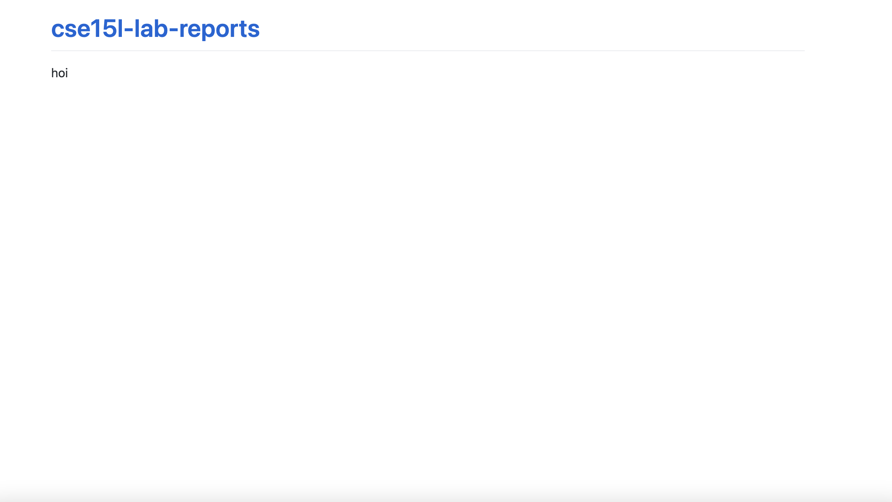

# Intro (Testing Markdown)
My name is **Von Taylor** and I sometimes also go by the nickname *Yoshi*.

## Lab Report Links
- [Week 1](https://von-taylor.github.io/cse15l-lab-reports/lab-report-week-1.html)
- [Week 3](https://von-taylor.github.io/cse15l-lab-reports/lab-report-week-3.html)
- [Week 5](https://von-taylor.github.io/cse15l-lab-reports/lab-report-week-5.html)

## Sub Intro
> - I am male
> - I am 20 years old

Favorite Foods in order are:
> 1. Rice
> 2. Bread
> 3. Shake Shack Burger

The name of my other file is called [meep](https://von-taylor.github.io/cse15l-lab-reports/meep.html)
My grandfather used to go by the name of [Rick][1]. He lived in Las Vegas and had a bad gambling problem, so whenever he had money, he would\
go down to the casinos and [roll][1].

[1]: https://www.youtube.com/watch?v=HPk-VhRjNI8 "Cat"

This is my pet cat: 

A `for loop` is a loop that does things for you
```
for(int i = 0; i < length; i++) { 
    ...
}
```

    A `while loop` is also a loop that does stuff
    int i = 0;
    while(i < length) {
       ...
    }


# Lab 0 Notes:
Everyone should be able to screenshot their page showing the text they wrote in their index.md 

    Screenshot: 



Conduct the following experiment: 
Note that in addition to seeing your file at, e.g, https://jpolitz.github.io/cse-15l-lab-report/, you can also see it with index.html added to the end of the URL: https://jpolitz.github.io/cse-15l-lab-report/index.html (Try it!). Add another file to your repository with any name you choose, but end it in the extension .md. Can you use this idea to see that file? 
```
Yes I can. Other file:
```
> [meep](https://von-taylor.github.io/cse15l-lab-reports/meep.html)

Write down what you think is happening when you commit a new file. 
```
What I believe is happening is that it is simply creating a more specific path that leads to another file 
inside the repository "cse-15l-lab-report" 
```

Skim both of those documents, then try to use some of the elements described in the cheat sheet in your index.md file. How do some of the different formatting options show up when you use them? Are any surprising?
```
They all transform the text on the page to look entirely different as compared to the text in the .md file.
All of them are quite surprising, especially the image one.
```

One thing that’s helpful on pages like yours is to have links between pages. Add a link to the index page of your site that points to your lab report page. Which of the following styles works?
```
The second option works --> [Lab Report 1](https://<your-username>.github.io/<your-lab-reports-repo>/lab-report-1-week-0.html)
```

# This is the lab report 1 for week 0:
[Lab Report 1](https://von-taylor.github.io/cse15l-lab-reports/lab-report-1-week-0.html)
