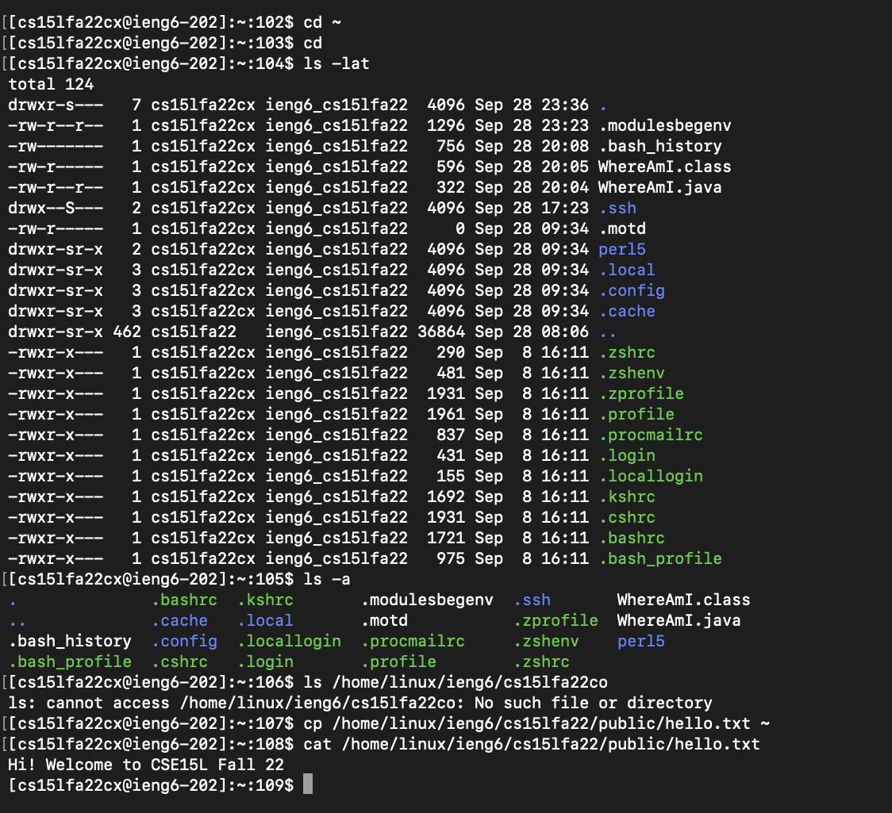

# Week 1 Lab Report (Getting Started)

**Steps that will be Covered:**
> 1. Installing VScode
> 2. Remotely Connecting
> 3. Trying Some Commands
> 4. Moving Files with scp
> 5. Setting an SSH Key
> 6. Optimizing Remote Running

## 1. Installing VScode
## 2. Remotely Connecting

- In this step, I connected my local personal computer to the remote ieng6 server by using the Secure Shell (ssh) program
- I did this by using the "ssh <*cs15lUsername*>@ieng6.ucsd.edu"
- If it's your first time doing this, you may have to answer "yes" to authorize and enter your cs15l password

## 3. Trying Some Commands

## 4. Moving Files with scp

## 5. Setting an SSH key

## 6. Optimizing Remote Running
