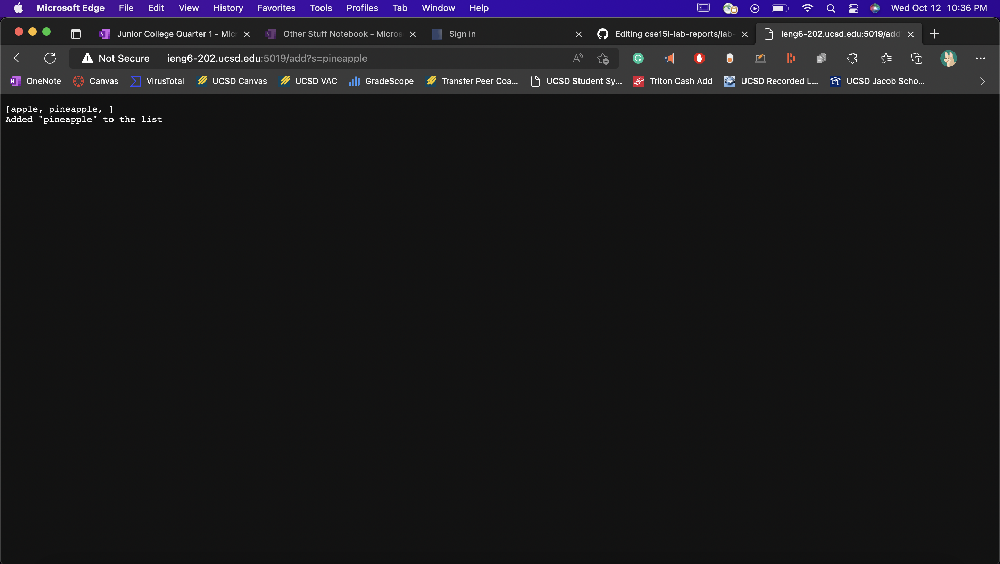
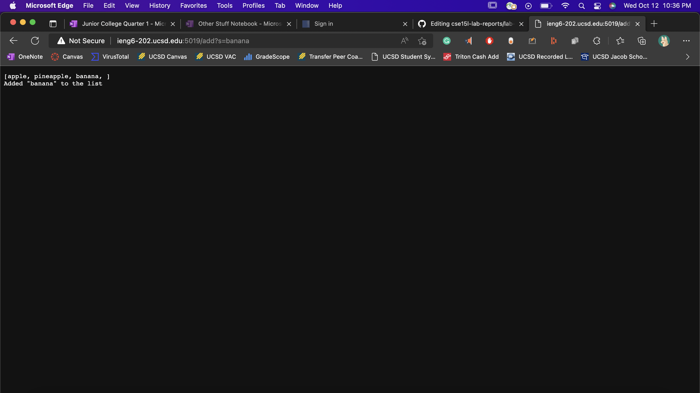
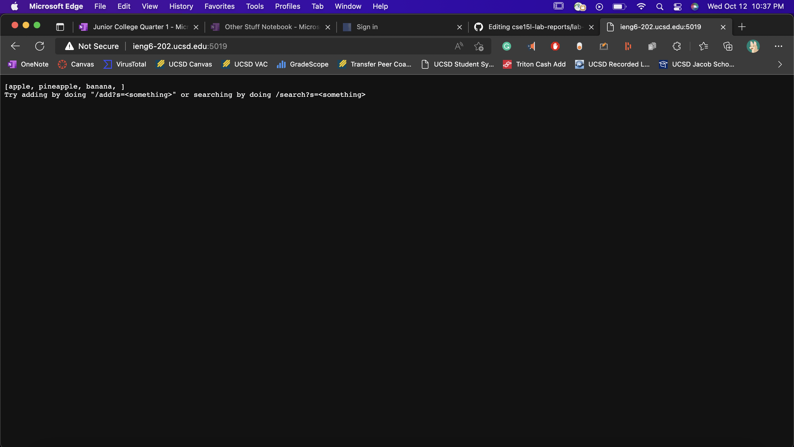

# Lab Report Week 3

## Code for Search Engine from week 2:
```
class Handler implements URLHandler {
    // The one bit of state on the server: a number that will be manipulated by
    // various requests.
    ArrayList<String> list = new ArrayList<>();
    String listItems;

    public String handleRequest(URI url) {
        if (url.getPath().equals("/")) {
            listItems = "[";

            if (!list.isEmpty())
                for (int i = 0; i < list.size(); i++) {
                    listItems += list.get(i) + ", ";
                }
            listItems += "]";

            return String.format(listItems
                    + "\nTry adding by doing \"/add?s=<something>\" or searching by doing /search?s=<something>");
        } else if (url.getPath().equals("/add")) {
            if (url.getQuery().isEmpty()) {
                return String.format("Input a valid query!");
            }

            String[] parameters = url.getQuery().split("=");
            list.add(parameters[1]);

            listItems = "[";
            for (int i = 0; i < list.size(); i++) {
                listItems += list.get(i) + ", ";
            }
            listItems += "]";

            return String.format(listItems + "\nAdded \"%s\" to the list", parameters[1]);
        } else if (url.getPath().equals("/search")) {
            if (url.getQuery().isEmpty()) {
                return String.format("Input a valid query!");
            }

            boolean found = false;
            String[] parameters = url.getQuery().split("=");
            String foundItems = "";

            for (int i = 0; i < list.size(); i++) {
                if(list.get(i).contains(parameters[1])) {
                    foundItems += "\"" + list.get(i) + "\" contains \"" + parameters[1] + "\"\n";
                    found = true;
                }
            }
            if (!found) {
                return String.format("\"%s\" not found D:", parameters[1]);
            }

            return String.format(foundItems);
        } else {
            System.out.println("Path: " + url.getPath());
            String.format("\"" + url.getPath() + "\" Invalid");

            return "404 Not Found!";
        }
    }
}

class SearchEngine {
    public static void main(String[] args) throws IOException {
        if (args.length == 0) {
            System.out.println("Missing port number! Try any number between 1024 to 49151");
            return;
        }

        int port = Integer.parseInt(args[0]);

        Server.start(port, new Handler());
    }
}
```

## Screenshots of using Add and Search:
### Adds:

- The "handleRequest" method is called and used.
- The relevant arguments to the "handleRequest" method is the URL that is used, so in this case, it's "http://ieng6-202.ucsd.edu:5019/add?s=apple".
  The fields in the "Handler" class that are used are the "list" and "listItems" fields. "list" is used to store the strings you add using the /add path and query.
  "listItems" is used to convert the contents in "list" to a string and print that out to the web page.

- The "handleRequest" method is called and used.
- The relevant arguments to the "handleRequest" method is the URL that is used, so in this case, it's "http://ieng6-202.ucsd.edu:5019/add?s=pineapple".
  The fields in the "Handler" class that are used are the "list" and "listItems" fields. "list" is used to store the strings you add using the /add path and query.
  "listItems" is used to convert the contents in "list" to a string and print that out to the web page.

- The "handleRequest" method is called and used.
- The relevant arguments to the "handleRequest" method is the URL that is used, so in this case, it's "http://ieng6-202.ucsd.edu:5019/add?s=banana".
  The fields in the "Handler" class that are used are the "list" and "listItems" fields. "list" is a list used to store the strings you add using the /add path and query.
  "listItems" is a string used to convert the contents in "list" to a string and print that out to the web page.

### Search:

- The "handleRequest" method is called and used.
- The relevant arguments to the "handleRequest" method is the URL that is used, so in this case, it's "http://ieng6-202.ucsd.edu:5019/search?s=app".
  The fields in the "Handler" class that are used are the "foundItems" and the "found" fields. "foundItems" is a string used to print the items from "list" that
  match the search query. "found" is a boolean used to tell the program whether to print that no items were found or not.

### Home Page:

- The "handleRequest" method is called and used.
- The relevant arguments to the "handleRequest" method is the URL that is used, so in this case, it's "http://ieng6-202.ucsd.edu:5019". 
  The field in the "Handler" class that is used is the "listItems" field. "listItems" is a string used to print the items from "list".
