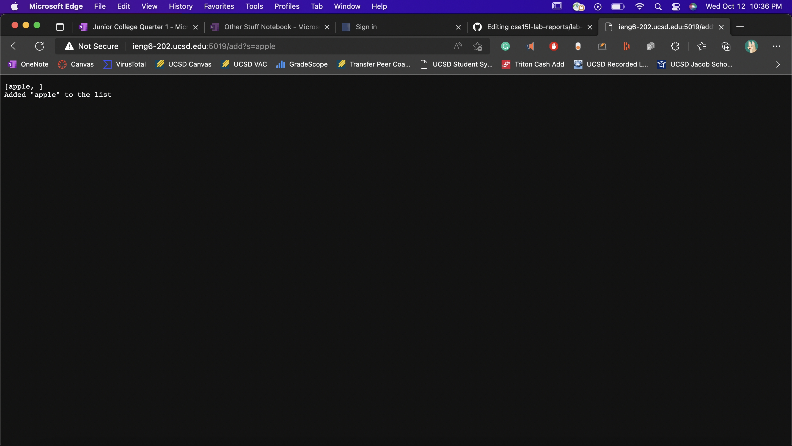

# Lab Report Week 3

## Part 1
## Code for Search Engine from week 2:
```
class Handler implements URLHandler {
    // The one bit of state on the server: a number that will be manipulated by
    // various requests.
    ArrayList<String> list = new ArrayList<>();
    String listItems;

    public String handleRequest(URI url) {
        if (url.getPath().equals("/")) {
            listItems = "[";

            if (!list.isEmpty())
                for (int i = 0; i < list.size(); i++) {
                    listItems += list.get(i) + ", ";
                }
            listItems += "]";

            return String.format(listItems
                    + "\nTry adding by doing \"/add?s=<something>\" or searching by doing /search?s=<something>");
        } else if (url.getPath().equals("/add")) {
            if (url.getQuery().isEmpty()) {
                return String.format("Input a valid query!");
            }

            String[] parameters = url.getQuery().split("=");
            list.add(parameters[1]);

            listItems = "[";
            for (int i = 0; i < list.size(); i++) {
                listItems += list.get(i) + ", ";
            }
            listItems += "]";

            return String.format(listItems + "\nAdded \"%s\" to the list", parameters[1]);
        } else if (url.getPath().equals("/search")) {
            if (url.getQuery().isEmpty()) {
                return String.format("Input a valid query!");
            }

            boolean found = false;
            String[] parameters = url.getQuery().split("=");
            String foundItems = "";

            for (int i = 0; i < list.size(); i++) {
                if(list.get(i).contains(parameters[1])) {
                    foundItems += "\"" + list.get(i) + "\" contains \"" + parameters[1] + "\"\n";
                    found = true;
                }
            }
            if (!found) {
                return String.format("\"%s\" not found D:", parameters[1]);
            }

            return String.format(foundItems);
        } else {
            System.out.println("Path: " + url.getPath());
            String.format("\"" + url.getPath() + "\" Invalid");

            return "404 Not Found!";
        }
    }
}

class SearchEngine {
    public static void main(String[] args) throws IOException {
        if (args.length == 0) {
            System.out.println("Missing port number! Try any number between 1024 to 49151");
            return;
        }

        int port = Integer.parseInt(args[0]);

        Server.start(port, new Handler());
    }
}
```

## Screenshots of using Add and Search:
### Adds:

- The "handleRequest" method is called and used.
- The relevant arguments to the "handleRequest" method is the URL that is used, so in this case, it's "http://ieng6-202.ucsd.edu:5019/add?s=apple".
  The fields in the "Handler" class that are used are the "list" and "listItems" fields. "list" is used to store the strings you add using the /add path and query.
  "listItems" is used to convert the contents in "list" to a string and print that out to the web page.
- If any of these values are changed through a request, then they update for all subsequent requests because of the infinite for loop that constantly seeks out requests.

- The "handleRequest" method is called and used.
- The relevant arguments to the "handleRequest" method is the URL that is used, so in this case, it's "http://ieng6-202.ucsd.edu:5019/add?s=pineapple".
  The fields in the "Handler" class that are used are the "list" and "listItems" fields. "list" is used to store the strings you add using the /add path and query.
- If any of these values are changed through a request, then they update for all subsequent requests because of the infinite for loop that constantly seeks out requests.
  "listItems" is used to convert the contents in "list" to a string and print that out to the web page.

- The "handleRequest" method is called and used.
- The relevant arguments to the "handleRequest" method is the URL that is used, so in this case, it's "http://ieng6-202.ucsd.edu:5019/add?s=banana".
  The fields in the "Handler" class that are used are the "list" and "listItems" fields. "list" is a list used to store the strings you add using the /add path and query.
  "listItems" is a string used to convert the contents in "list" to a string and print that out to the web page.
- If any of these values are changed through a request, then they update for all subsequent requests because of the infinite for loop that constantly seeks out requests.

### Search:

- The "handleRequest" method is called and used.
- The relevant arguments to the "handleRequest" method is the URL that is used, so in this case, it's "http://ieng6-202.ucsd.edu:5019/search?s=app".
  The fields in the "Handler" class that are used are the "foundItems" and the "found" fields. "foundItems" is a string used to print the items from "list" that
  match the search query. "found" is a boolean used to tell the program whether to print that no items were found or not.
- If any of these values are changed through a request, then they update for all subsequent requests because of the infinite for loop that constantly seeks out requests.

### Home Page:

- The "handleRequest" method is called and used.
- The relevant arguments to the "handleRequest" method is the URL that is used, so in this case, it's "http://ieng6-202.ucsd.edu:5019". 
  The field in the "Handler" class that is used is the "listItems" field. "listItems" is a string used to print the items from "list".
- If any of these values are changed through a request, then they update for all subsequent requests because of the infinite for loop that constantly seeks out requests.


## Part 2
## ListExamples.java bug:
```
  // Takes two sorted list of strings (so "a" appears before "b" and so on),
  // and return a new list that has all the strings in both list in sorted order.
  static List<String> merge(List<String> list1, List<String> list2) {
    List<String> result = new ArrayList<>();
    int index1 = 0, index2 = 0;
    while(index1 < list1.size() && index2 < list2.size()) {
      if(list1.get(index1).compareTo(list2.get(index2)) < 0) {
        result.add(list1.get(index1));
        index1 += 1;
      }
      else {
        result.add(list2.get(index2));
        index2 += 1;
      }
    }
    while(index1 < list1.size()) {
      result.add(list1.get(index1));
      index1 += 1;
    }
    while(index2 < list2.size()) {
      result.add(list2.get(index2));
      index1 += 1; // <-------------------------------- bug here
    }
    return result;
  }
```
- Failure-inducing input: 2 merged array lists
```
List<String> input1Array1 = new ArrayList<>();
String[] tempInput1Array1 = {"apple","cat","eden","golf","idiom"};
for(String s: tempInput1Array1) { input1Array1.add(s); }

List<String> input1Array2 = new ArrayList<>();
String[] tempInput1Array2 = {"bat","dandelion","falcon","happy","kite","mop","television"};
for(String s: tempInput1Array2) { input1Array2.add(s); }

List<String> expect1 = new ArrayList<>();
String[] tempExpect1 = {"apple","bat","cat","dandelion","eden","falcon","golf","happy","idiom","kite","mop","television"};
for(String s: tempExpect1) { expect1.add(s); }

assertEquals(expect1, ListExamples.merge(input1Array1, input1Array2));
```
- Symptom: 

- Bug:
```
while(index2 < list2.size()) {
    result.add(list2.get(index2));
    index1 += 1; // <-------------------------------- bug here
}
```
 - Bug to symptom relation: the bug causes the symptom because it iterates "index1" instead of "index2", which causes the while loop to infinitely loop since its condition will forever be met. After it finishes iterating through the first array, the 1st while loop is exited, the 2nd while loop is skipped, and then it enters the 3rd while loop, except its condition variable, "index2", never gets incremented, so it never exits it.

## LinkedListExamples.java bug:
```
/**
* Adds the value to the _end_ of the list
* @param value
*/
public void append(int value) {
    if(this.root == null) {
        this.root = new Node(value, null);
        return;
    }
    // If it's just one element, add if after that one
    Node n = this.root;
    if(n.next == null) {
        n.next = new Node(value, null);
        return;
    }
    // Otherwise, loop until the end and add at the end with a null
    while(n.next != null) {
        n = n.next;
        n.next = new Node(value, null); // <--------------------------- bug here
    }
}
```
- Failure-inducing input: Linked list with root 2 followed by 5,8,12,15
```
LinkedList root1 = new LinkedList();

root1.append(2);
root1.append(5);
root1.append(8);
root1.append(12);
root1.append(15);

assertEquals("2 5 8 12 15 ", root1.toString());
```
- Symptom: 

- Bug:
```
// Otherwise, loop until the end and add at the end with a null
while(n.next != null) {
    n = n.next;
    n.next = new Node(value, null); // <--------------------------- bug here
}
```
- Bug to symptom relation: the bug causes the symptom because the line that causes the problem should be outside the while loop instead of inside. The fact that it's inside the while loop is what causes the while loop infinitely loop since its condition will forever be met. When it tries to append 8 to the linked list, it enters the while loop, in which it constantly sets its next node to null, meaning that the condition of the while loop will forever be met.
