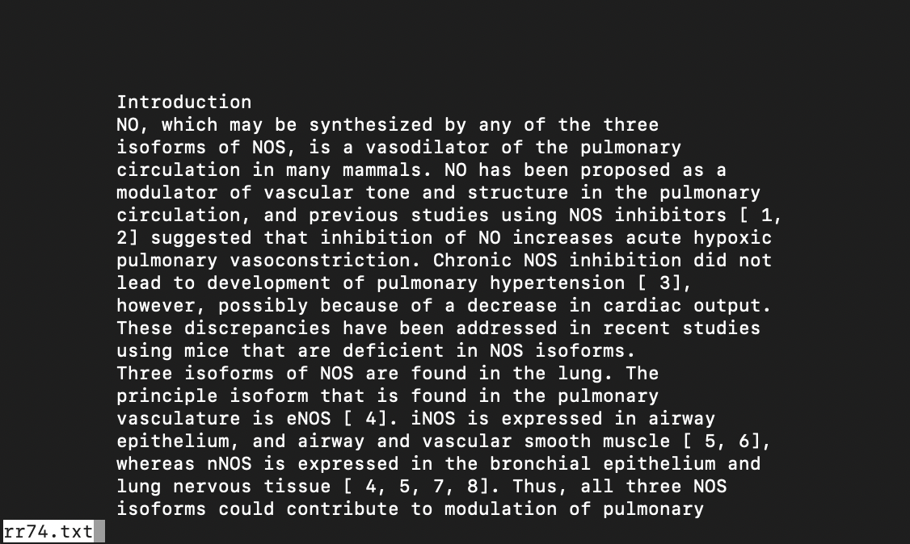

# Lab Report Week 5
## Linux Commands to Inspect:
- less: similar to 'cat' command, except allows you to have all the contents of the file on 1 screen instead of just on the terminal.
- find: recursively lists all the relative paths of the files in a directory and its subdirectories onto the terminal.
- grep: accepts a string argument, in which it searches a file and prints all lines in it that have the given string.

    >   (all of this is done with text files inside the technical/biomed directory)

### 3 Interesting Command-Line Options for "less"
1. -J command
    >   `less -J rr74.txt`
    > 
    > Output:
    >   
    > - In this screen, by pressing 'm' then any character on your keyboard, it will mark the first line on the current screen that\
    >   contains that letter.
3.
4.

### 3 Interesting Command-Line Options for "find"
1.
2.
3.

### 3 Interesting Command-Line Options for "grep"
1.
2.
3.
