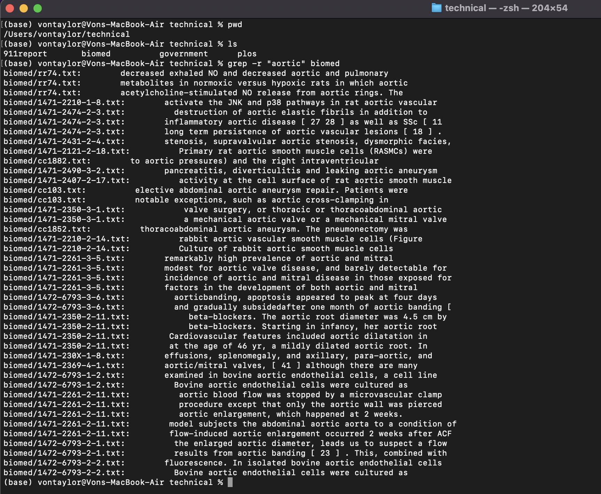

# Lab Report Week 5
- **HTML Link:** [https://von-taylor.github.io/cse15l-lab-reports/lab-report-week-5.html](https://von-taylor.github.io/cse15l-lab-reports/lab-report-week-5.html)
## Linux Commands to Inspect:
- less \<regularFile>: similar to 'cat' command, except allows you to have all the contents of the file on 1 separate screen instead of just\
on the terminal.
- find \<fileName>: recursively lists all the relative paths of the files in a directory and its subdirectories onto the terminal.
- grep "\<string>" \<regularFile>: accepts a string argument, in which it searches a file and prints all lines in it that have the given string.
    
    >   (All of this is done with files inside the 'technical' directory)

## 3 Interesting Command-Line Options for "less"
#### *(Working Directory: /Users/vontaylor/technical/biomed)*

1. -N command
    > `less -N <regularFile>`
    > - (For the output, I choose my \<regularFile> to be "rr74.txt", "c1476.txt", and "bcr45.txt")
    
    > Output 1:
    > 
    >
    > Output 2:
    > 
    > 
    > Output 3: 
    > 
    > 
    > - What this command does is display the line numbers in the file that you open with the 'less' command. This is useful\
    > for quality-of-life purposes where you might want to know where you are inside of a file that you are reading.

#### *(Working Directory: /Users/vontaylor/technical/911report)*
    > - (For the output, I choose my \<regularFile> to be "chapter-13.5.txt")
    > 

2. -p command
    > `less -p<string> <regularFile>`
    > - \<string> is any string the user wants to input
    > - (For the output, I choose my \<string> to be "med" and my \<regularFile> to be "rr74.txt")
    
    > Output:
    > 
    > - What this command does is tells 'less' to start at the first instance of "med" in the file. This is also useful for\
    > quality of life purposes where you may want to start reading the file from a string that of your choosing.
    
3. -z command
    > `less -z<number> <regularFile>`
    > - \<number> is any positive integer the user wants to input
    > - (For the output, I choose my \<number> to be 5, my \<regularFile> to be "rr74.txt", and press 'space' on my keyboard once\
    > after entering the 'less' screen)
    
    > Output:
    > 
    > - What this command does it makes it so that when you press 'space' on your keyboard while in the 'less' screen of your file,\
    > the screen will only move down 5 lines instead of the default 1 entire screen down. This is also useful for quality-of-life\
    > purposes for when you want to skip a down the screen only a few lines, but don't want to skip down to the entire next screen,\
    > which is the default.

## 3 Interesting Command-Line Options for "find"
#### *(Working Directory: /Users/vontaylor)*

1. -type command
    > `find <directory> -type <fileType>`
    > - \<fileType> is any one of the key letters that were preset by Linux
    > - The 2 main useful \<fileType>'s for my current purposes are 'd' for directory and 'f' for regular file
    > - (For the output, I choose my \<directory> to be "technical" and my \<fileType> to be 'd')
    
    > Output:
    > 
    > - What this command does is it recursively lists all relative paths to files in a file that are directories. This is useful\
    > for when you want to only list all the subdirectories in a directory, but not all the regular files within them.

2. -iname command
    > `find <directory> -iname "<fileName>"`
    > - For the sake of showing how this command works, I created an additional txt file called "WATER_FLEES.txt"
    > - (For the output, I choose my \<directory> to be "technical" and my \<fileName> to be "water_\*.txt")
    
    > Output:
    > 
    > - What this command does is it recursively lists all relative paths to files that match the "water_\*.txt" string, just like\
    > the -name command except that it also ignores case. This is useful for when you want to list all files that are similar but\
    > have different cases.

3. -empty command
    > `find <directory> -empty`
    > - The txt file that I created earlier called "WATER_FLEES.txt" is an empty file for the sake of showing how this command works
    >  (For the output, I choose my \<directory> to be "technical")

    > Output:
    > 
    > - What this command does is it recursively lists all relative paths to regular files whose contents are empty. This is\
    > useful for when you need some sort of way to find all the empty regular files in a directory and its subdirectories so\
    > that you can, for example, get rid of them.

## 3 Interesting Command-Line Options for "grep"
#### *(Working Directory: /Users/vontaylor/technical/biomed)*

1. -A command
    > `grep -A <number> "<string>" <regularFile>`
    > - (For the output, I choose my \<number> to be 5, my "\<string>" to be "aortic", and my \<regularFile> to be "rr74.txt")
    
    > Output:
    > 
    > - What this command does is it finds and prints all the lines in "rr74.txt" that match "aortic", in which it additionally\
    > then prints the next subsequent 5 lines after each match. This is useful for times when you want to search for a specific\
    > string in a file and then read the next lines or paragraphs after it.

2. -i command
    > `grep -i "<string>" <regularFile>`
    > - (For the output, I choose my "\<string>" to be "immunohistochemistry", and my \<regularFile> to be "rr74.txt")

    > Output:
    > 
    > - What this command does is it does the normal grep command except that it ignores the case of "immunohistochemistry".\
    > This could be useful for times when you want to find the lines in a regular files that match the inputted string, but you don't\
    > care about the case of the found strings.

3. -r command
    > `grep -r "<string>" <directory>`
    > - For the sake of showing how this command works, I switched my working directory to */Users/vontaylor/technical*
    > - (For the output, I choose my "\<string>" to be "aortic", and my \<directory> to be "biomed")

    > Output:
    > 
    > - What this command does is it recursively does a 'grep' on all regular files in technical and its subdirectories (if it had).\
    > This could be useful when you want to find all the files and their respective lines that contain a certain string. This one\
    > command basically has similar functionality to outputting the output of the 'find' command into a txt file and then\
    > inputting that txt file into the 'grep' command.

# (END Lab Report Week 5)
