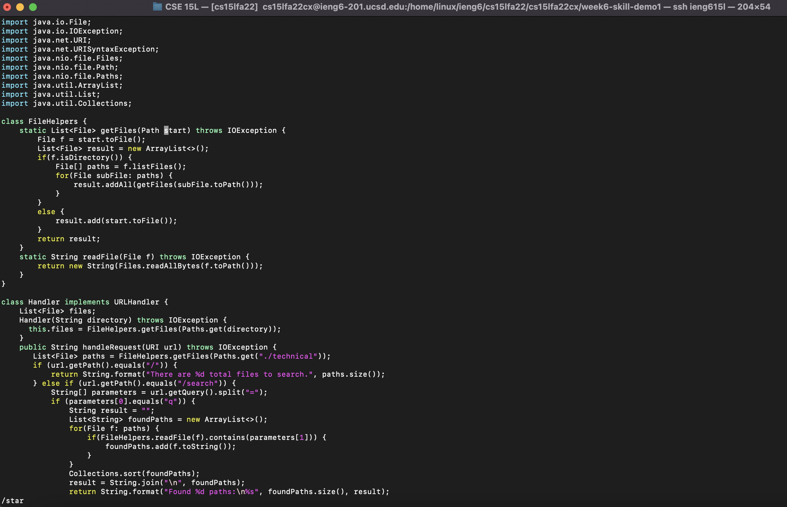
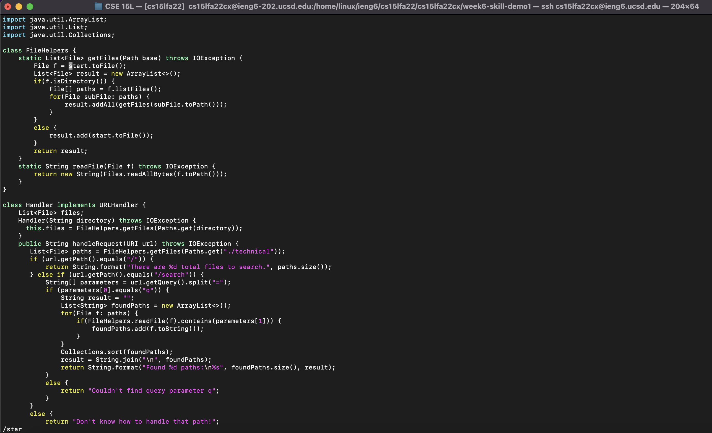
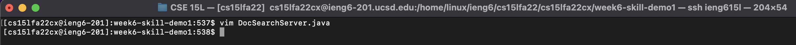

# Lab Report Week 7
- **HTML Link:** [https://von-taylor.github.io/cse15l-lab-reports/lab-report-week-7.html](https://von-taylor.github.io/cse15l-lab-reports/lab-report-week-7.html)

## Part 1 Chosen Task:
- In `DocSearchServer.java`, change the name of the `start` parameter of `getFiles`, and all of its uses, to instead be called `base`.

Key Strokes:
  > `/star<Enter>cebase<Esc>n.n.:wq<Enter>`
  >
  > Screenshot of `/star<Enter>`:
  > 
  > 
  > Screenshot of `cebase<Esc>`:
  > 
  > 
  > Screenshot of `n.`:
  > 
  > 
  > Screenshot of `n.`:
  > 
  > 
  > Screenshot of `:wq<Enter>`:
  > 

## Part 2 scp vs vim:
- scp procedure: make the edit to `TestDocSearch.java`, scp it over to the remote server, ssh into the remote server, cd into the right\
directory, and then run `bash test.sh`
  > Time elapsed: 1 minute 19 seconds

- vim procedure: ssh into the remote server, cd into right directory, vim into `TestDocSearch.java`, make the edit, exit\
`TestDocSearch.java`, and then run `bash test.sh`
  > 

- Verdict: 
