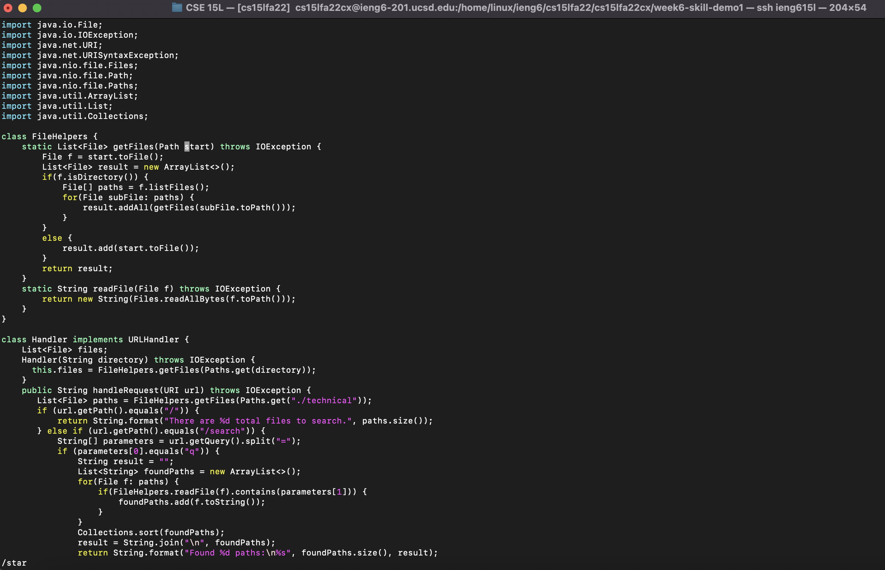
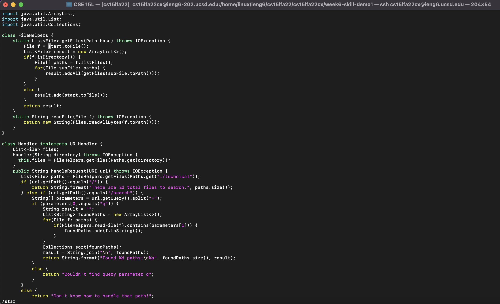
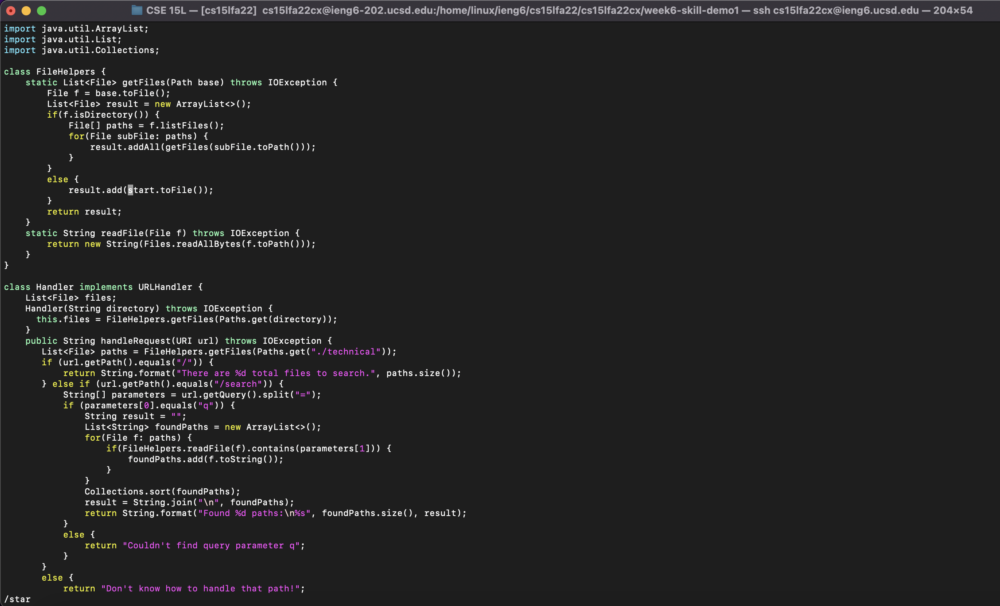
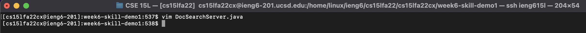

# Lab Report Week 7
- **HTML Link:** [https://von-taylor.github.io/cse15l-lab-reports/lab-report-week-7.html](https://von-taylor.github.io/cse15l-lab-reports/lab-report-week-7.html)

## Part 1 --\> using vim:
- **Chosen Task**: In `DocSearchServer.java`, change the name of the `start` parameter of `getFiles`, and all of its uses, to instead be called `base`.

Key Strokes: `/star<Enter>cebase<Esc>n.n.:wq<Enter>`
  >
  > Screenshot of `/star<Enter>`:
  > 
  > 
  > Screenshot of `cebase<Esc>`:
  > 
  > 
  > Screenshot of `n`:
  > 
  > a
  > Screenshot of `.`:
  > 
  > 
  > Screenshot of `n`:
  > 
  > 
  > Screenshot of `.`:
  > 
  > 
  > Screenshot of `:wq<Enter>`:
  > 

## Part 2 --\> scp vs vim:
- scp procedure: make the edit to `TestDocSearch.java`, scp it over to the remote server, ssh into the remote server, cd into the right directory, and then run `bash test.sh`
  > Time elapsed: 01 minute 19 seconds\
  > Difficulties: had to remember the name of the directory on the remote server that I wanted to scp `TestDocSearch.java` and type out the long scp and ssh commands twice

- vim procedure: ssh into the remote server, cd into right directory, vim into `TestDocSearch.java`, make the edit, exit `TestDocSearch.java`, and then run `bash test.sh`
  > Time elapsed: 00 minutes 38 seconds\
  > Difficulties: unlike VSCode, vim doesn't have autofill features and other quality-of-life features that VSCode has, although some of them can be taken care of by creating and putting things into a `.vimrc` file

- Verdict: it is much easier and faster to ssh into the remote server and then make the edits directly into there. Although this time comparison doesn't seem that extravagent, making edits directly on the server is exceedingly much better when you have to make edits to multiple different files, maybe in different directories, instead of having to consume time just to locally scp each file to their respective directory on the remote, and then only then, being able to go back onto the server to run them.

### Questions
1. Which of these two styles would you prefer using if you had to work on a program that you were running remotely, and why?
  > I would rather use the vim method if I had to work on a program that I was running remotely, because I have experienced how much more manageable and faster it is to use vim on the remote server through my CSE 30. Additionally, sometimes the terminal on the remote server has software that allows certain programs to be run on the remote server, but not on my local computer since I'm missing the software, so it's a lot more reasonable to just work completely on the remote server.
2. What about the project or task might factor into your decision one way or another? (If nothing would affect your decision, say so and why!)
  > If I was working with only a few files, have the necessary software to work on a project locally, and I wanted access to autofill, syntax highlighting, auto-format, and all the quality-of-life features that VSCode has to offer, then I would prefer to work locally and just scp the few files over. However, if I had to work on many different files, and don't think that the absence of the quality-of-life features of VSCode will hinder me too much, then I would much prefer to just work directly on all the many files on the remote server using vim.
