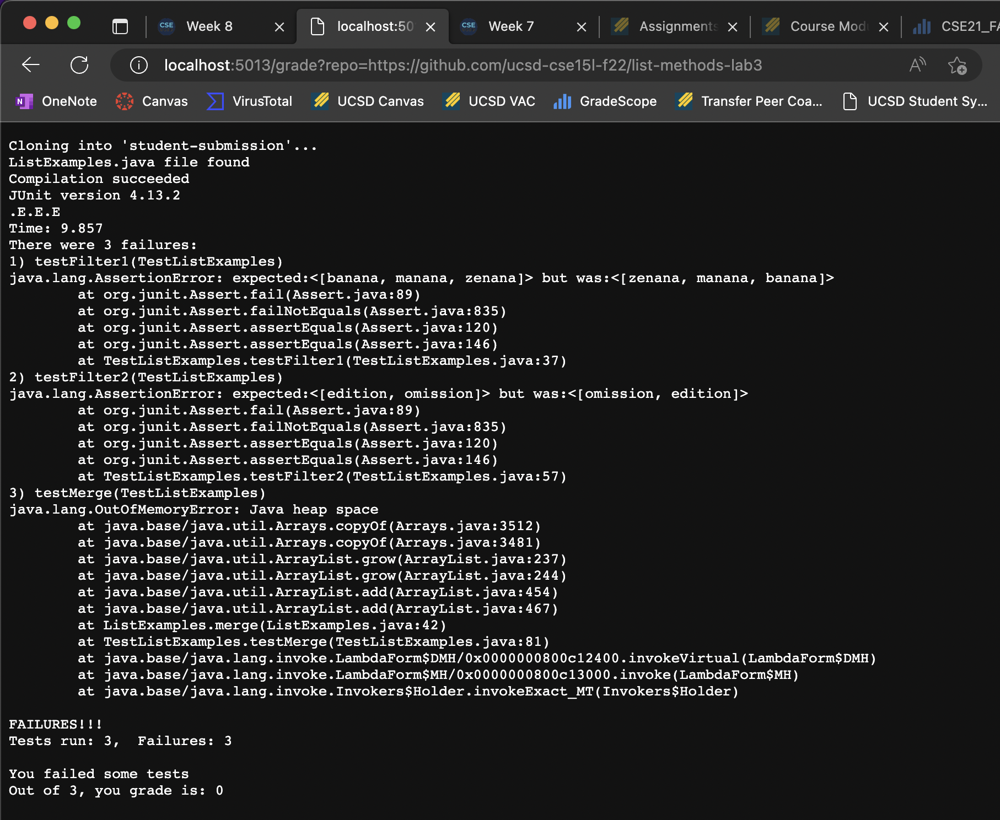
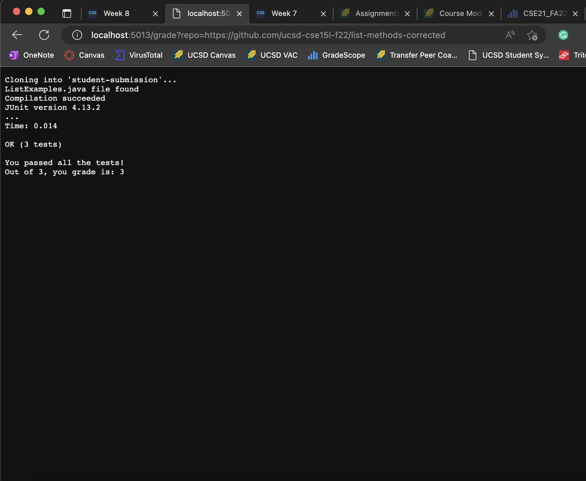
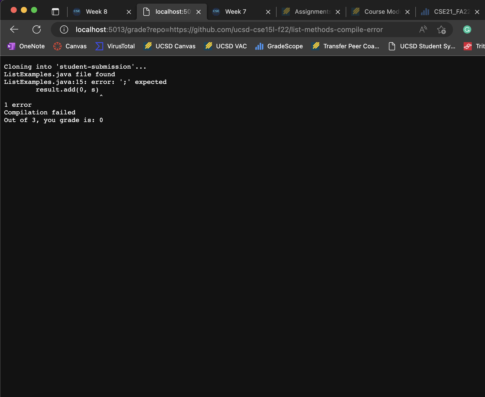

# Lab Report Week 9
- **HTML Link:** [https://von-taylor.github.io/cse15l-lab-reports/lab-report-week-9.html](https://von-taylor.github.io/cse15l-lab-reports/lab-report-week-9.html)

## grade.sh:
```
# Create your grading script here

# set -e

rm -rf student-submission
git clone $1 student-submission
GRADE=0

# check if ListExamples.java exists
cd student-submission
if [ -f ListExamples.java ]
then
    echo "ListExamples.java file found"
else
    echo "ListExamples.java file not found"
    echo "Grade is: "$GRADE
    exit 1
fi

cd ..
cp -r lib student-submission/
cp TestListExamples.java student-submission/
cd student-submission
javac -cp .:lib/hamcrest-core-1.3.jar:lib/junit-4.13.2.jar *.java

# check that the compile went fine
if [ $? -eq 00 ]
then
    echo "Compilation succeeded"
else
    echo "Compilation failed"
    echo "Out of 3, you grade is: "$GRADE
    exit 1
fi

java -cp .:lib/hamcrest-core-1.3.jar:lib/junit-4.13.2.jar org.junit.runner.JUnitCore TestListExamples

if [ $? -eq 00 ]
then
    GRADE=3
    echo "You passed all the tests!"
    echo "Out of 3, you grade is: "$GRADE
else
    echo "You failed some tests"
    echo "Out of 3, you grade is: "$GRADE
fi
```

## Screenshots of **three** different student submissions and their reported grade as loaded in the browser:
> Sample Submission 1: https://github.com/ucsd-cse15l-f22/list-methods-lab3
> 

> Sample Submission 2: https://github.com/ucsd-cse15l-f22/list-methods-corrected
> 

> Sample Submission 3: https://github.com/ucsd-cse15l-f22/list-methods-compile-error
> 

## Choose one of the examples you showed in screenshot, and describe a trace of what your `grade.sh` does on that example
- Chosen Screenshot --> Sample Student Submission 2

1. For each line with a command, what its standard output and standard error are for this run, and whether its return code was zero or nonzero
> - For the `git clone $1 student-submission` line, its standard error was nothing, its return code was 0, and its standard output was:
> ```
> Cloning into 'student-submission'...
> remote: Enumerating objects: 3, done.
> remote: Counting objects: 100% (3/3), done.
> remote: Compressing objects: 100% (2/2), done.
> remote: Total 3 (delta 0), reused 3 (delta 0), pack-reused 0
> Receiving objects: 100% (3/3), done.
> ```
> - For the `echo "ListExamples.java file found"` line, its standard error was nothing, its return code was 0, and its standard output was:
> ```
> ListExamples.java file found
> ```
> - For the `javac -cp .:lib/hamcrest-core-1.3.jar:lib/junit-4.13.2.jar *.java` line, its standard error was nothing, its return code was 0, and its standard output was also nothing.
> - For the `echo "Compilation succeeded"` line, its standard error was nothing, its return code was 0, and its standard output was:
> ```
> Compilation succeeded
> ```
> - For the `java -cp .:lib/hamcrest-core-1.3.jar:lib/junit-4.13.2.jar org.junit.runner.JUnitCore TestListExamples` line, its standard error was nothing, its return code was 0, and its standard output was:
> ```
> JUnit version 4.13.2
> ...
> Time: 0.014
> 
> OK (3 tests)
> ```
> - For the `echo "You passed all the tests!"` line, its standard error was nothing, its return code was 0, and its standard output was:
> ```
> You passed all the tests!
> ```
> - For the `echo "Out of 3, you grade is: "$GRADE` line, its standard error was nothing, its return code was 0, and its standard output was:
> ```
> Out of 3, you grade is: 3
> ```

2. For each line with an `if` statement, whether the condition was true or false, and why
> - For the `if [ -f ListExamples.java ]` line, the condition evaluated to true because the `ListExamples.java` file from the sample repository existed
> - For the `if [ $? -eq 00 ]` line, the condition evaluated to true because the `javac -cp .:lib/hamcrest-core-1.3.jar:lib/junit-4.13.2.jar *.java` did not return a nonzero exit code
> - For the `if [ $? -eq 00 ]` line, the condition evaluated to true because the `java -cp .:lib/hamcrest-core-1.3.jar:lib/junit-4.13.2.jar org.junit.runner.JUnitCore TestListExamples` did not return a nonzero exit code

3. Indicate each line that does not run (maybe because it is in an `if` branch that doesn’t evaluate, or after an early exit)
> - The lines that don't run include:
> ```
> echo "ListExamples.java file not found"
> echo "Grade is: "$GRADE
> exit 1
> ```
> ```
> echo "Compilation failed"
> echo "Out of 3, you grade is: "$GRADE
> exit 1
> ```
> ```
> echo "You failed some tests"
> echo "Out of 3, you grade is: "$GRADE
> ```
